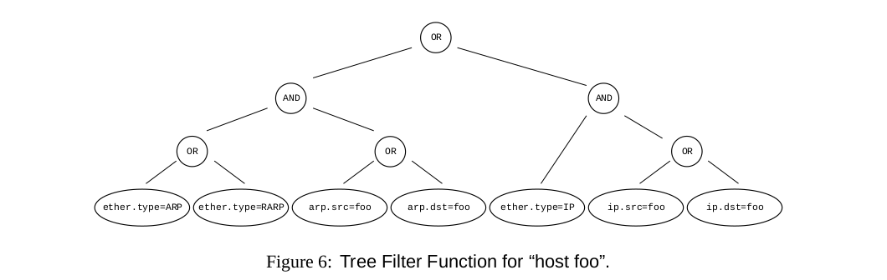
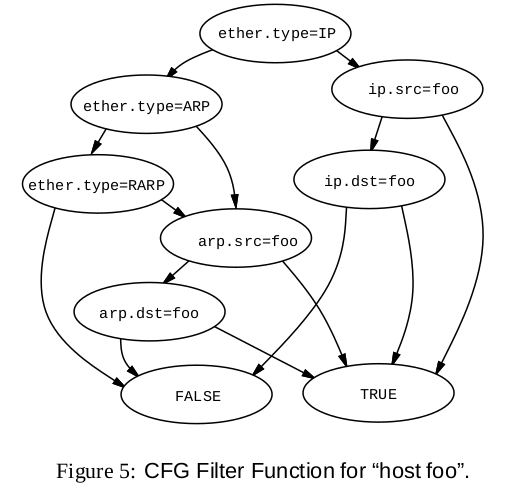
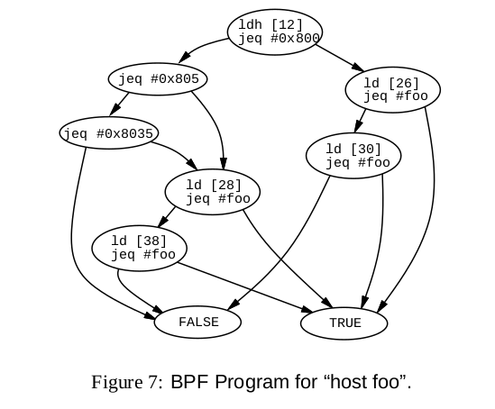
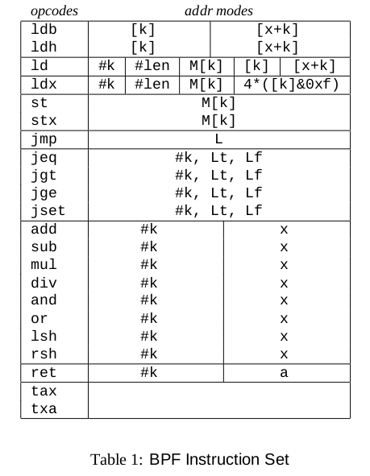
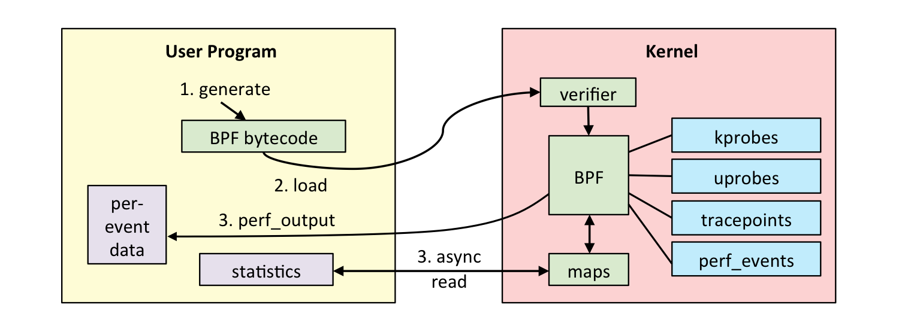
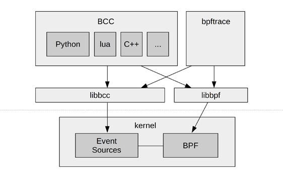

BSD Packet Filter

---

Intial version based on following paper later came to be known as classic BPF  
  
[Paper Link](https://www.tcpdump.org/papers/bpf-usenix93.pdf "Follow this for original paper")

---

tcpdump demo

--

Commands:  
::: block
|             |                                      |
|:-----------:|:-------------------------------------|
|*tcpdump*    | `sudo tcpdump -XX -i lo 'ip and tcp'`|
|*tcp server* | `nc -t -l -p 4444`                |
|*tcp client* | `nc -t localhost 4444`              |
{style=font-size:75%;}
:::

---

Components of BPF  
::: block
**NetworkTap**  
collects copies of packets from network device drivers & delivers them to listening applications  
**PacketFilter**  
decides if the packet shouild be accepted and how much of it should be copied
{style=text-align:left;font-size:45%}
:::


---

Optimizations against existing implementations
- Alignment
- Merge NetworkTap & Filter
- Introduce buffering
- Register based implementation
- Directed acyclic control flow graph(CFG) against boolean expression tree

---

Tree based filter


::: block
- 7 comparision predicates
- 6 boolean operators
{style=font-size:50%}
:::

---

 Directed acyclic control flow graph (CFG) based

         |        
---------:|:------------
|

::: block
- Max 5 comparisions
{style=font-size:50%}
:::

---

BPF Pseudo Machine

<table style="font-size:60%">
<tbody>
<tr><td>
<table>
<thead>
<tr><th>Abstraction</th><th>Operations</th></tr>
</thead>
<tbody>
<tr><td>1 accumulator</td><td>Load instructions</td></tr>
<tr><td>1 index register</td><td>Store instructions</td></tr>
<tr><td>1 scratch memory</td><td>ALU instructions</td></tr>
<tr><td>1 implicit program counter</td><td>Branch instructions</td></tr>
<tr><td></td><td>Return instructions</td></tr>
<tr><td></td><td>Miscellaeous instructions</td></tr>
</tbody>
</table>
</td>
<td>

</td>
</tr>
</tbody>
</table>

---

Modern day BPF

::: block
| Classical BPF (cBPF)                         | Extended BPF (eBPF)                                      |
|----------------------------------------------|----------------------------------------------------------|
| Network packet filtering, eventually seccomp | More registers, JIT compiler (flexible/faster), verifier |
| Filter Expressions → Bytecode → Interpret    | Attach on Tracepoint/Kprobe/Uprobe/USDT                  |
| Small, in-kernel VM. Register based, switch  | In-kernel trace aggregation & filtering                  |
|                                              | Control via bpf(), trace collection via BPF Maps         |
{style=font-size:50%;}
:::

---

eBPF Internals



---

It is extremely tedious to write bpf program by hand



::: block
- Front ends like BCC, bpftrace, ply help to create the bpf programs
{style=font-size:50%}
:::

---

bpftrace 
::: block 
+ OneLiners:  
 trace all the open calls
```bpftrace
sudo bpftrace -e 'tracepoint:syscalls:sys_enter_open* { @[probe] = count(); }'
```
...  
+ script
+ sudo ./bpftrace/tools/opensnoop.bt
```bpftrace
BEGIN
{
        printf("Tracing open syscalls... Hit Ctrl-C to end.\n");
        printf("%-6s %-16s %4s %3s %s\n", "PID", "COMM", "FD", "ERR", "PATH");
}

tracepoint:syscalls:sys_enter_open,
tracepoint:syscalls:sys_enter_openat
{
        @filename[tid] = args->filename;
}

tracepoint:syscalls:sys_exit_open,
tracepoint:syscalls:sys_exit_openat
/@filename[tid]/
{
        $ret = args->ret;
        $fd = $ret > 0 ? $ret : -1;
        $errno = $ret > 0 ? 0 : - $ret;

        printf("%-6d %-16s %4d %3d %s\n", pid, comm, $fd, $errno,
            str(@filename[tid]));
        delete(@filename[tid]);
}

END
{
        clear(@filename);
}
```
{style=font-size:45%;text-align:left;}
:::

---

bcc
::: block
- sudo ./bcc/tools/opensnoop.py
- sudo ./bcc/tools/opensnoop.py -x
- sudo ./bcc/tools/execsnoop.py
{style=font-size:70%;text-align:left;}
:::

---

bcc programming
<section style="font-size:70%">
<ul>
<li>Restrictions:
<ul>
  <li>No loops or kernel function calls</li>
  <li>Only use bpf_*kernel helper functions and some compiler built-ins</li>
  <li>All memory reads using bpf_probe_read()</li>
  <li>Memory can only be read to BPF stacks or BPF maps. Stack for storing small objects and map for large</li>
</ul></li>
<li>3 ways to output data from kernel to user:
<ul>
  <li>BPF_PERF_OUTPUT()</li>
  <li>BPF_HISTOGRAM() or other BPF maps</li>
  <li>bpf_trace_printk()</li>
  </ul>
  </li>
</ul>
</section>

---

hello_world.py
```python
#!/usr/bin/python 
from bcc import BPF 
b = BPF(text=""" 
int kprobe__do_nanosleep() 
{ 
    bpf_trace_printk("Hello, World!\\n"); 
    return 0; 
}"""); 
b.trace_print()
```

---

sleepsnoop.py
::: block
```python
#!/usr/bin/python 

from bcc import BPF 
 
# BPF program 
b = BPF(text=""" 
struct data_t { 
    u64 ts; 
    u32 pid;
};

BPF_PERF_OUTPUT(events);
int kprobe__do_nanosleep(void *ctx) {
     struct data_t data = {};
     data.pid = bpf_get_current_pid_tgid();
     data.ts = bpf_ktime_get_ns() / 1000;
     events.perf_submit(ctx, &data, sizeof(data));
      return 0;
  };
""")

# header
print("%-18s %-6s %s" % ("TIME(s)", "PID", "CALL"))

# process event
def print_event(cpu, data, size):
    event = b["events"].event(data)
    print("%-18.9f %-6d Hello, World!" % ((float(event.ts) / 1000000),
       event.pid))

# loop with callback to print_event
b["events"].open_perf_buffer(print_event)
while 1:
    try:
        b.perf_buffer_poll()
    except KeyboardInterrupt:
        exit()
```
{style=font-size:70%;}
:::

---

Readings  
```
https://qmonnet.github.io/whirl-offload/2016/09/01/dive-into-bpf/  
https://blog.cloudflare.com/bpf-the-forgotten-bytecode/  
https://danielmiessler.com/study/tcpdump/  
[A thorough introduction to eBPF](https://lwn.net/Articles/740157/)  
https://github.com/iovisor/bcc/blob/master/docs/tutorial.md  
https://netflixtechblog.com/netflix-at-velocity-2015-linux-performance-tools-51964ddb81cf  
http://www.brendangregg.com/ebpf.html  
https://medium.com/@beatrizmrg/network-security-for-microservices-with-ebpf-bis-478b40e7befa  
```

---

FIN