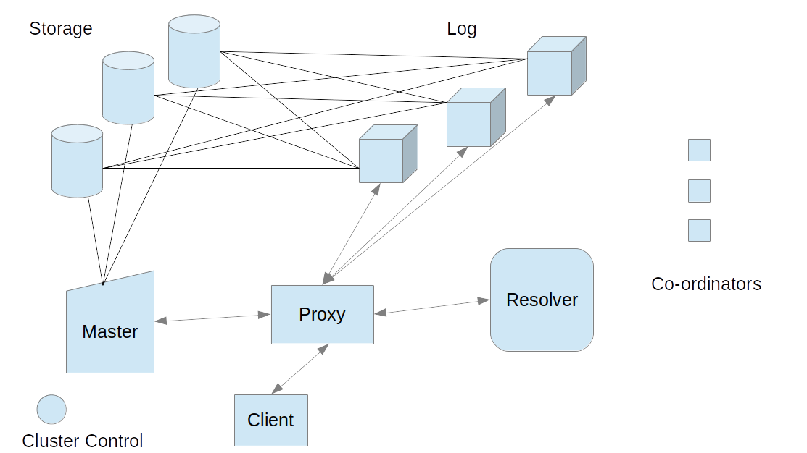

Foundation DB

- MultiVersion Concurrency control
- Redwood storage engine* announced for storage

---

Components:
1. Co-ordinators - Acts as load balanacers and also help in maintaining quorum.
1. Proxy - Connect to the clients to take read and write requests
1. Resolver - Resolve and validate if the read or write is stale and whether the client should re-try the operation
1. Master - Assign Version numbers (for reads & writes) where the requsts are often batched by the proxy to de-bottleneck its effect
1. Log - Accept write requests which are distributed to storage for persistence
1. Storage - Gets the content from Log for persistence and addresses reads.
1. Cluster Control - Monitor all the components and trigger fault tolenece if any malfunction detected
1. Client - Issues read or write requests

---

Foundation Db

---

Fault tolerance:
1. Cluster controller detected that something failed
1. New master selected
1. Master will try to connect to all Logs
1. Vmin - min version commited by all logs
1. Storage will sync till Vmin & discard everything > Vmin
1. VCurrent = Vmin + Long Number