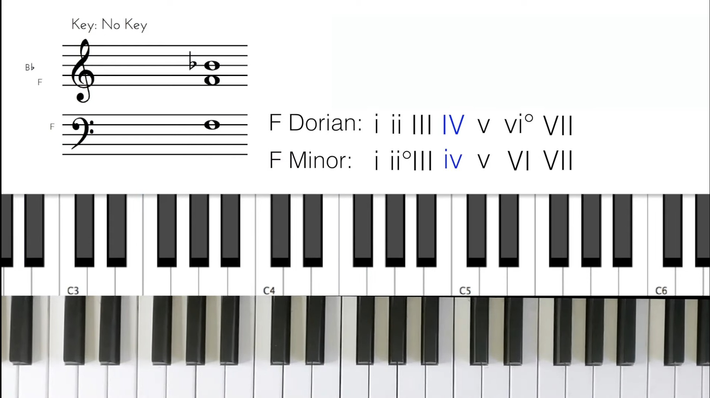
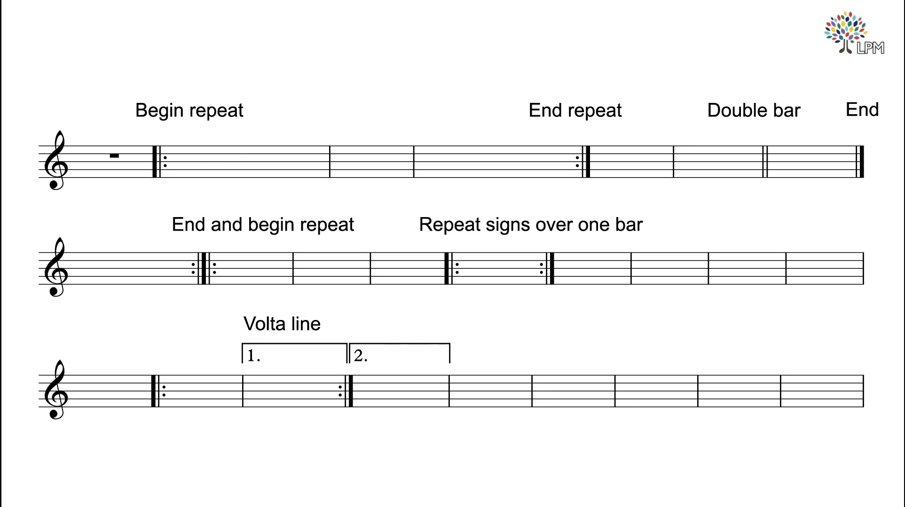
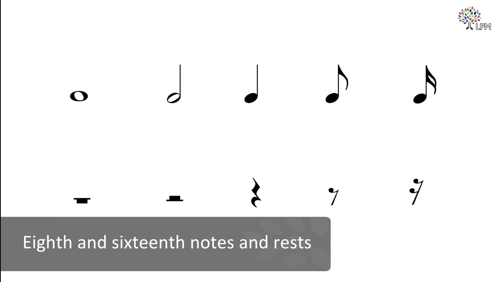
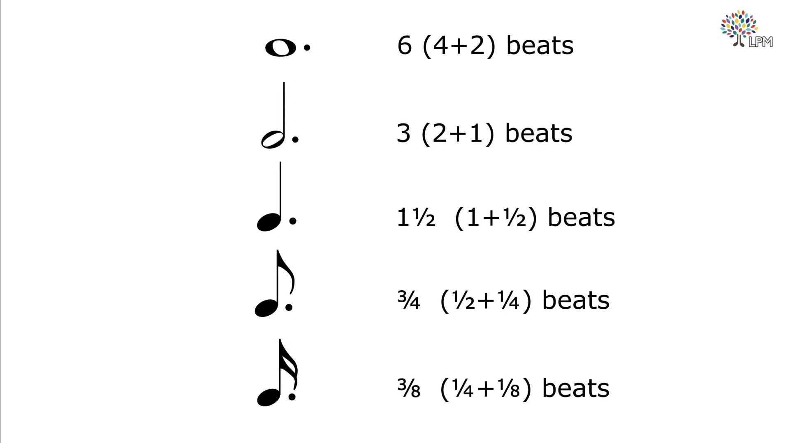
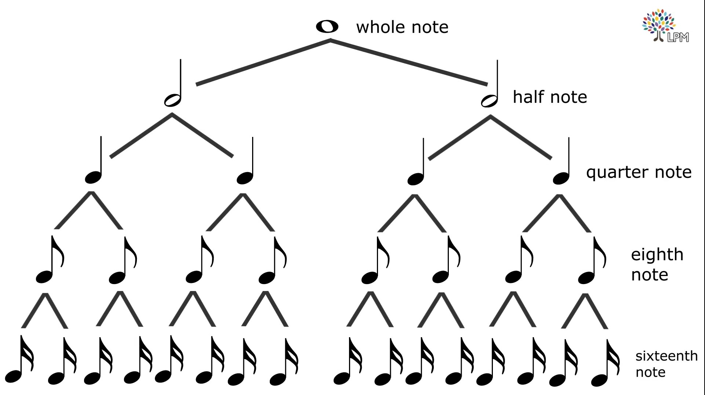

Music Theory
- Specifications:
  - A4 = 440 Hz
  - [Pitch Standard](https://en.wikipedia.org/wiki/A440_(pitch_standard) "Wiki Link")
  - [ISO 16:1975](https://www.iso.org/standard/3601.html "ISO Link")

---

Notes  

- Natural Notes:
  - A B C D E F G
- Accidental Notes:
  - A# C# D# F# G#
  - Bb Db Eb Gb Ab

---

- SemiTone -> Smallest gap/Interval possible between 2 notes aka HalfStep
- SemiTone + SemiTone = Tone aka WholeStep
- We get 12 intervals
- The frequency doubles after 12 intervals
- A4 = 440 Hz | A5 = 880 Hz
- SCALE- Arrangement of notes
  - 8 note intervals
    - Major Scale
    - Minor Scale

---

- Major Scale
  - RT2T3S4T5T6T7S8
  - C-Major = CTDTESFTGTATBSC
  - E-Major = ETF#TG#SATBTC#TD#SE

- Minor Scale
  - RT2S3T4T5S6T7T8
  - C-Minor = CTDSD#TFTGSG#TA#TC
  - E-Minor = ETF#SGTATBSCTDTE

---

Music

- Melody - 1 note at a time  
  `+`
- Harmony - More than 1 note at a time (chord)  
  `+`
- Rhythm - Intervals at which chords and melody are arranged

---

Chords

- Triads
  - 3 note chords (Between notes, only Major 3rd and Minor 3rd allowed)
  - `*M*m*` - Major
  - `*m*M*` - Minor
  - `*m*m*` - Diminished
  - `*M*M*` - Augmented
- SemiTone + SemiTone = Tone
  - S + S + S = Minor 3rd
  - S + S + S + S = Major 3rd
- Major Triad
  - RSSSSXSSSX
  - R    3    5
  - C    E    G - C Major Chord
- Minor Triad
  - RSSSXSSSSX
  - R     b3   5
  - C     Eb       G - C Minor Chord
  - C     D#       G - C Minor Chord

---

Chords (Contd...)

- Diminished Triad
  - RSSSXSSS
  - R   b3  b5
  - C   Eb  Gb - C Diminished Chord
- Augmented Triad
  - RSSSSXSSSSX
  - R    3    #5
  - C    E    G#
- Suspended Chords
  - R  2  5 (Sus 2)
  - R  4  5 (Sus 4)

---

Interval Names
::: block
A-A# SemiTone - HalfStep - Minor 2nd  
A-B Tone - WholeStep - Major 2nd  
A-C Minor 3rd  
A-C# Major 3rd  
A-D Perfect 4th  
A-D# Tri Tone  
A-E Perfect 5th  
A-F m 6  
A-F# M 6  
A-G m 7  
A-G# M 7  
A-A Octave
{style=text-align:left;font-size:60%;}
:::

---

<section style="font-size:50%;text-align:left;">

- Harmonizing scales or Chords in same Scale

 | | | | | | | | 
-|-|-|-|-|-|-
R|R|R|R|R|R|R
3|b3|b3|3|3|b3|b3
5|5|5|5|5|5|b5#
M|m|m|M|M|m|dim
 | | | | | | | |
G|A|B|C|D|E|F#
B|C|D|E|F#|G|A
D|E|F#|G|A|B|C
G|Am|Bm|C|D|Em|F#dim
I|ii|iii|IV|V|vi|VIIo

- 4 note harmony  
M7m7m7M7dim7M7m7b5  

 | | | | | | | |
-|-|-|-|-|-|-|-|
G|A|B|C|D|E|F#
B|C|D|E|F#|G|A
D|E|F#|G|A|B|C
F#|G|A|B|C|D|E

</section>

---

- Scales
  - Major
  - Dorian
  - Phyrigion
  - Lydian - Dreamy
  - Mixolydian
  - Minor
  - Lochrian
- Chord Funtions
  - I  ->  vi  -> Resolve
  - IV ->  ii  -> Resolve
  - V  -> iii  -> Unresolve

---

Reading Music Sheet

---

---

---

